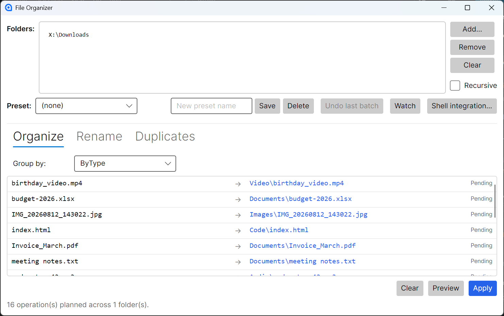

<div align="center">

# File Organizer

**Clean up any messy folder in seconds: sort, rename and de-duplicate files, with a preview before anything moves and one-click undo after.**

[](https://github.com/moustafarhat/FileOrganizer/actions/workflows/ci.yml)
[](https://github.com/moustafarhat/FileOrganizer/releases/latest)
[](https://github.com/moustafarhat/FileOrganizer/releases)
[](LICENSE)




### [⬇ Download for Windows, macOS or Linux](https://github.com/moustafarhat/FileOrganizer/releases/latest)

Free · Open source · Works offline · No account, no telemetry

</div>

## Why File Organizer?

- **Nothing happens by surprise.** Every batch shows a `source → target` preview first, and **Undo last batch** puts every file back.
- **Your files stay on your machine.** The app never connects to the internet or uploads anything.
- **One app, every OS.** Native builds for Windows, macOS and Linux with no runtime to install.
- **Built for real clutter.** Downloads folders, photo dumps, old project drives: organize, bulk-rename and remove duplicates across many folders at once.

---

## Features

### Organize
- **By type** — group files into `Images/`, `Documents/`, `Audio/`, `Video/`, `Archives/`, `Code/`, `Executables/`, `Fonts/`, `Other/`
- **By size** — bucket into `Tiny (<1MB)`, `Small (1–10MB)`, `Medium (10–100MB)`, `Large (100MB–1GB)`, `Huge (≥1GB)`
- **By date** — group by year or year-month, using either modified or created timestamps

### Rename
- Predefined styles: `snake_case`, `kebab-case`, `PascalCase`, `camelCase`, `UPPERCASE`, `lowercase`, date-prefix, sequential-prefix
- Custom token patterns: `{date:yyyy-MM-dd}_{seq:003}_{kebab}{ext}`
- Tokens: `{name}`, `{ext}`, `{date:format}`, `{created:format}`, `{seq[:padding]}`, `{snake}`, `{kebab}`, `{pascal}`, `{camel}`, `{upper}`, `{lower}`, `{size}`

### Duplicate finder
- Cross-folder duplicate detection — finds copies across every selected folder, not just one
- Size pre-filter + SHA-256 hashing (skips the slow path when no two files share size)
- Per-group selection: keep one, quarantine the rest
- Quarantine moves duplicates to `_Duplicates_<timestamp>/` inside each file's containing root, so moves stay on the same volume and remain undoable

### Multi-folder
- Add multiple folders and apply the same plan across all of them in one preview/apply
- Drag-drop folders from your file manager directly into the app
- Per-folder watchers, per-folder quarantine, cross-folder deduplication

### Safety
- **Preview-then-apply** for every batch operation
- **Undo last batch** — every apply is journaled to `%LOCALAPPDATA%/FileOrganizer/history/` (or the platform equivalent). Undo restores files to their original locations and cleans up empty folders
- **Collision handling** — `(1)`, `(2)`, ... suffixes for genuinely conflicting targets; case-only renames on case-insensitive file systems are handled correctly

### Workflow
- **Presets** — save `(folders + tab + mode + settings + rename pattern)` as a named profile. One-click load later
- **Watch folder mode** — monitor folders with `FileSystemWatcher` and auto-organize new arrivals. Includes file-lock retry (waits up to 6 seconds for downloads to finish writing)
- **Windows shell integration** — installs an "Organize with File Organizer" entry into the Explorer right-click menu (folders and folder backgrounds). User-level only (HKCU), no admin required
- **Command-line argument support** — `FileOrganizer.exe "C:\Downloads"` launches the app with the folder pre-added

---

## Download

Ready-to-run builds for every version are on the [Releases page](https://github.com/moustafarhat/FileOrganizer/releases/latest). No .NET installation needed.

| Platform | File |
|---|---|
| Windows x64 | `FileOrganizer-vX.Y.Z-win-x64.zip`: unzip and run `FileOrganizer.exe` |
| Linux x64 | `FileOrganizer-vX.Y.Z-linux-x64.tar.gz`: extract and run `./FileOrganizer` |
| macOS Apple Silicon | `FileOrganizer-vX.Y.Z-osx-arm64.tar.gz` |
| macOS Intel | `FileOrganizer-vX.Y.Z-osx-x64.tar.gz` |

On macOS the app isn't notarized, so Gatekeeper blocks the first launch. Run `xattr -d com.apple.quarantine FileOrganizer` in the extracted folder once, then start it normally.

---

## Requirements (building from source)

- [.NET 10 SDK](https://dotnet.microsoft.com/download/dotnet/10.0) or later
- Windows 10/11, modern Linux distributions, or macOS 11+

---

## Getting started

```sh
git clone https://github.com/moustafarhat/FileOrganizer.git
cd FileOrganizer
dotnet run
```

To build a release executable:

```sh
dotnet publish FileOrganizer.csproj -c Release -r win-x64    # Windows x64
dotnet publish FileOrganizer.csproj -c Release -r linux-x64  # Linux x64
dotnet publish FileOrganizer.csproj -c Release -r osx-arm64  # Apple Silicon
```

Releases are automatic: bump `<Version>` in `FileOrganizer.csproj` and push to `main`. The Release workflow runs the smoke tests, builds all four platforms and publishes them as release `v<Version>`. Pushes that don't change the version don't create a release.

---

## Usage

### Organizing a folder

1. Click **Add...** or drag a folder into the drop zone
2. Pick a tab — **Organize** or **Rename**
3. Choose your grouping mode or rename style
4. Click **Preview** — the planned operations appear as a `source → target` list
5. Review and click **Apply**
6. If anything's wrong, click **Undo last batch**

### Finding duplicates

1. Add one or more folders
2. Switch to the **Duplicates** tab
3. Click **Scan for duplicates** — each group is shown with size, count, and recoverable bytes
4. By default the first file in each group is kept; check or uncheck rows to change the selection
5. Click **Move selected to quarantine** — confirms, then moves selected duplicates to `_Duplicates_<timestamp>/` inside each root
6. Use **Undo last batch** to restore everything if needed

### Watching a folder

1. Add folders and switch to the **Organize** tab
2. Configure your grouping mode
3. Click **Watch** — the app monitors all selected folders and auto-organizes new files as they arrive
4. The green **● Watching** badge confirms the watcher is live; click **Watch** again to stop

### Installing shell integration (Windows)

1. Click **Shell integration…** in the toolbar
2. Click **Install** — adds an "Organize with File Organizer" entry to the right-click menu for folders
3. Right-click any folder in Explorer to launch the app with that folder pre-loaded
4. Click **Uninstall** in the same dialog to remove it

### Presets

1. Configure folders + settings the way you want them
2. Type a name in the preset textbox and click **Save**
3. Later, pick the preset from the dropdown — all folders and settings are restored
4. Click **Delete** to remove a saved preset

---

## Architecture

```
FileOrganizer/
├── Models/                        DTOs and converters
│   ├── OrganizeMode.cs            mode + date enums
│   ├── PlannedOperation.cs        single move/rename plan
│   ├── OperationLog.cs            persisted apply log for undo
│   ├── DuplicateGroup.cs          one duplicate set
│   ├── Preset.cs                  saved profile
│   ├── RenamePattern.cs           rename style + options
│   └── Converters.cs              Avalonia value converters
├── Services/                      Pure business logic (no UI)
│   ├── Categorizer.cs             type/size/date bucketing
│   ├── Renamer.cs                 token-based rename engine
│   ├── OperationPlanner.cs        builds plans (organize / rename / single-file)
│   ├── OperationExecutor.cs       applies plans and undoes logs
│   ├── OperationLogStore.cs       JSON persistence + pruning
│   ├── DuplicateFinder.cs         SHA-256 dedup with size pre-filter
│   ├── PresetStore.cs             JSON-per-preset persistence
│   ├── FolderWatcher.cs           FileSystemWatcher with debounced queue
│   └── ShellIntegrationService.cs HKCU registry integration (Windows)
├── ViewModels/                    MVVM bindings (CommunityToolkit.Mvvm)
│   ├── MainWindowViewModel.cs
│   ├── DuplicateGroupViewModel.cs
│   └── ViewModelBase.cs
└── Views/                         Avalonia XAML
    ├── MainWindow.axaml
    └── MainWindow.axaml.cs        folder picker, drag-drop, dialogs
```

The **Services** layer is pure C# with no Avalonia dependencies — that's what lets the smoke-test project link the same files and validate the logic headlessly.

---

## Development

### Build

```sh
dotnet build FileOrganizer.csproj
```

### Run the GUI

```sh
dotnet run

# Or launch with a folder preloaded (also works via shell integration):
dotnet run -- "C:\Downloads"
```

### Run smoke tests

The smoke-test project covers the entire service layer headlessly — multi-folder organize, undo, cross-folder dedup, preset round-trips, and a live registry round-trip on Windows.

```powershell
dotnet run --project FileOrganizer.SmokeTest
```

Each assertion prints `PASS` or `FAIL`. Exit code is non-zero if anything fails.

### Data locations

| Type       | Path |
|------------|------|
| Apply logs | `%LOCALAPPDATA%/FileOrganizer/history/` (Windows), `~/.local/share/FileOrganizer/history/` (Linux), `~/Library/Application Support/FileOrganizer/history/` (macOS) |
| Presets    | Same parent, `presets/` subfolder |

Logs are pruned to the most recent 20.

---

## Roadmap

Ideas that aren't built yet, in rough priority order:

- **Filter rules** — only files matching a glob, older/newer than N days, larger/smaller than N MB, ignore patterns (`.git/`, `node_modules/`, `.DS_Store`)
- **EXIF / ID3 metadata** in rename tokens — `{exif:date}`, `{exif:camera}`, `{id3:artist}_{id3:album}_{id3:title}`
- **Conflict policy per run** — Skip / Overwrite / Keep both / Ask (instead of the current always-keep-both)
- **Scheduled presets** — run a preset on a cron-style schedule via Task Scheduler / launchd / systemd
- **macOS Services + Linux file-manager integration** — extend shell integration beyond Windows
- **Empty folder cleanup** after organize

---

## Contributing

Contributions are welcome, from bug reports to new features. Read [CONTRIBUTING.md](CONTRIBUTING.md) to get started, and see the [Roadmap](#roadmap) for ideas. If File Organizer saves you time, a ⭐ helps other people find it.

## License

[MIT](LICENSE) © Moustafa Farhat
